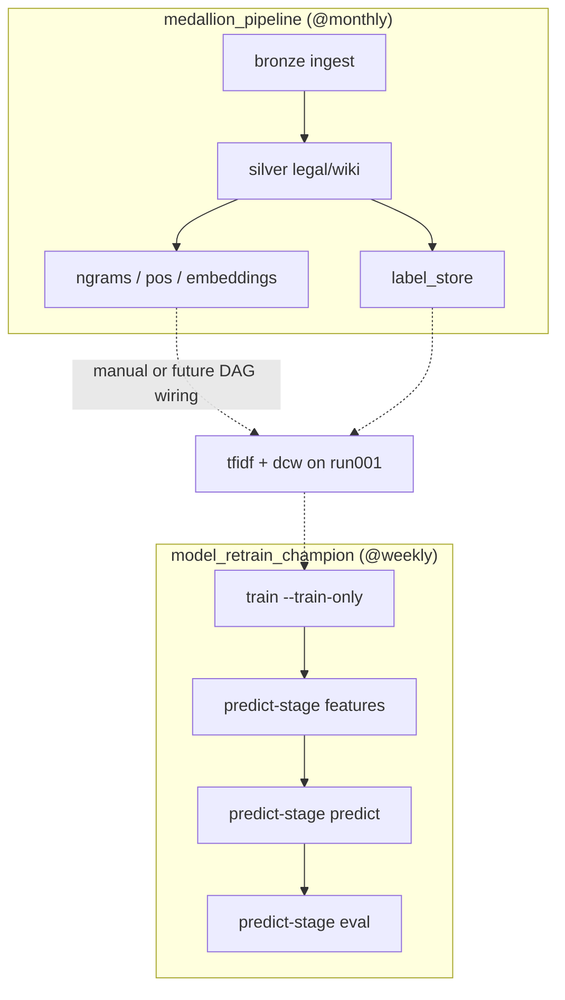

# Model training & prediction guide

End-to-end reference for multi-label topic classification using precomputed Gold features, Spark ML binary relevance, and v2 run-versioned storage on R2.

For bucket layout and migration from v1, see also `docs/storage_layout.md` and `run_registry.yaml`.

---

## 1. High-level pipeline

```
Upstream (run separately)
  ngrams → TF-IDF (tfidf_processing.py) → gold/runs/run001/tfidf_*
  ngrams → DCW (domain_concept_weight.py)  → gold/runs/run001/dcw_*
  corpus → embeddings                      → gold/embeddings
  label_store                              → gold/label_store

Training (model_pipeline/model_training.py)
  Inference (model_pipeline/model_inference.py --predict-only)
  train-only  → fit per-label models + X_train + manifest + feature importance
  predict     → score val/test/oot → predictions Delta + metrics manifest

Evaluation
  notebooks/predict_results.ipynb  → compare experiments, threshold sweep
  notebooks/exp004_review.ipynb    → feature importance, grid trials, metrics per exp
```

**Important:** `model_pipeline` does **not** refit TF-IDF, DCW, or embeddings. It only joins precomputed tables and trains/scores classifiers.

Legacy path `include/training/model_training.py` remains as a thin shim (routes to train or inference based on `--predict-only`).

---

## 2. IDs (three roles)

| Flag | Example | Purpose |
|------|---------|---------|
| `--exp-id` | `exp004_LR_tfidf_dcw_gs` | **Experiment** — models, manifest, metrics, feature importance under `model_bank/experiments/{exp_id}/` |
| `--feature-run-id` | `run001` | **Upstream features** — read TF-IDF/DCW tables + pickles from `gold/runs/run001` and `model_bank/features/run001` |
| `--gold-run-id` | `run004` | **Assembled matrices** — read/write `X_train` / `X_val_test_oot` under `gold/runs/{gold_run_id}` |

### Deprecated aliases (still accepted)

| Old | New |
|-----|-----|
| `--run-id` | `--exp-id` |
| `--x-run-id` | `--gold-run-id` |
| `--prediction-suffix` | `--exp-id` (folder name under `prediction_date=` partition) |

### Typical pattern (reuse upstream gold, isolate experiments)

```powershell
--exp-id exp004_LR_tfidf_dcw_gs `
--feature-run-id run001 `          # shared TF-IDF + DCW
--gold-run-id run004               # isolated X_train / X_val_test_oot
```

If `--gold-run-id` is omitted, assembled X uses the same path as `--feature-run-id`.

Reusing `--feature-run-id run001` does **not** duplicate TF-IDF/DCW tables. Only experiment artefacts and assembled X (under `--gold-run-id`) are new per experiment.

---

## 3. R2 layout (v2)

### Shared corpus (not run-scoped)

```
s3a://cs611-project/gold/
  ngrams/
  embeddings/
  label_store/          # split in column `category`: train | val | test | oot
  pos_tags/
```

### Feature run (`run001` — primary upstream fit)

```
gold/runs/run001/
  tfidf_train
  tfidf_val_test_oot
  dcw_train
  dcw_val_test_oot
  X_train                 # when --gold-run-id run001
  X_val_test_oot

model_bank/features/run001/
  tfidf.pkl
  dcw.pkl
  tfidf/                  # JSON audit exports
  dcw_score/
  dcw_train_doc_ids/
```

`run002`–`run004` under `gold/runs/` hold **assembled X only** (TF-IDF/DCW still read from `run001`).

### Experiment (`exp004_LR_tfidf_dcw_gs`)

```
model_bank/experiments/exp004_LR_tfidf_dcw_gs/
  model/
    per_label/{safe_label_name}/     # Spark ML binary model per label
  manifest/
    logistic_regression_YYYYMMDD.pkl
    logistic_regression_YYYYMMDD.json
  metrics/
    prediction_YYYYMMDD.pkl          # holdout metrics manifest
    prediction_YYYYMMDD.json
  feature_importance/
    feature_importance_YYYYMMDD.json
```

### Predictions (date partition + experiment id)

```
gold/model_predictions/
  prediction_date=2026-06-15/
    exp004_LR_tfidf_dcw_gs/           # Delta: predictions + prob_* columns
```

Predictions are keyed by **`--prediction-date`** + **`--exp-id`**, not by gold run id. Each Delta row includes `run_id` (exp id), `feature_run_id`, and `prediction_ts` for traceability.

**Migration:** legacy flat folders (`prediction_20260613_LR`, `model_bank/runs/...`) are copied to v2 by `scripts/migrate_storage_layout.py`. See `run_registry.yaml` for the mapping.

---

## 4. Feature sets

| `--feature-set` | Contents |
|-----------------|----------|
| `tfidf_dcw_embeddings` | **Default** — TF-IDF + DCW + Legal-BERT embeddings |
| `tfidf_dcw` | TF-IDF + DCW only (no embeddings) |
| `log_tfidf_dcw` | Log-TF-IDF + DCW |
| `embeddings` | Embeddings only |
| `dcw` | DCW only |
| `all` | Log-TF-IDF + DCW + embeddings |

**Rule:** Train, features stage, and predict must use the **same** `--feature-set`. The assembled `features` vector must match what the model was trained on.

---

## 5. Model types & hyperparameters

### Binary relevance

One binary classifier per label (15 labels). Multi-label output is built by thresholding each label's positive-class probability.

### Random Forest (default model type)

| Param | Default | CLI override |
|-------|---------|--------------|
| `numTrees` | 50 | `--num-trees` |
| `maxDepth` | 10 | `--max-depth` |
| `maxBins` | 32 | `--max-bins` |

RF on full sparse TF-IDF (~50k) + DCW (~8k) is **memory-heavy** in Docker. Prefer single fits over grid search, or use LR for `tfidf_dcw` experiments.

### Logistic Regression

| Param | Default | CLI override |
|-------|---------|--------------|
| `maxIter` | 100 | `--max-iter` |
| `regParam` | 0.0 | `--reg-param` |
| `elasticNetParam` | 0.0 | `--elastic-net-param` |

```powershell
--model-type random_forest          # default
--model-type logistic_regression
```

**Critical:** `--model-type` at predict time must match the saved `per_label/` models. The code auto-detects model type from Spark metadata when CLI and disk disagree.

### Prediction threshold

| Param | Default | Notes |
|-------|---------|-------|
| `--multilabel-threshold` | 0.5 | Label included if `prob >= threshold` |

Saved prediction Delta includes `prob_*` columns so you can sweep thresholds in a notebook without re-scoring.

### Grid search (`--grid-search`)

Tunes on the **val** split only. Saves best hyperparameters in the training manifest; only the best model is written to `model/per_label/`.

| Model | Grid (default) | Combos |
|-------|----------------|--------|
| LR | `regParam` × `elasticNetParam` (5 × 3), `maxIter=100` | 15 |
| RF | `numTrees` × `maxDepth` × `maxBins` (2 × 3 × 2) | 12 |

```powershell
--grid-search                          # LR or RF (must match --model-type)
--grid-search-metric micro_f1          # default
--grid-search-metric macro_f1
--grid-search-metric exact_match_ratio
```

Grid search implies loading holdout features even with `--train-only` (val split is required).

### Feature importance (`--feature-importance-top-k`)

Default: **50** (set `0` to skip). Saved under `feature_importance/feature_importance_YYYYMMDD.json`.

| Model | Method | Global ranking field |
|-------|--------|----------------------|
| LR | \|coefficient\| | `mean_abs_coefficient` |
| RF | Gini importance | `mean_importance` |

---

## 6. Training flow

### 6.1 Train only (recommended first step)

Fits models on **train split only** (18,640 docs). With `--grid-search`, also loads val for tuning. Skips test/oot scoring and predictions.

```powershell
docker compose build document-topic-tagger

docker compose run --rm `
  -e SPARK_DRIVER_MEMORY=8g `
  -e SPARK_MASTER=local[2] `
  document-topic-tagger python include/model_pipeline/model_training.py `
  --exp-id exp004_LR_tfidf_dcw_gs `
  --feature-run-id run001 `
  --gold-run-id run004 `
  --feature-set tfidf_dcw `
  --model-type logistic_regression `
  --grid-search `
  --grid-search-metric micro_f1 `
  --train-only
```

**Writes:**

- `model_bank/experiments/{exp_id}/model/per_label/*`
- `model_bank/experiments/{exp_id}/manifest/{model_type}_YYYYMMDD.pkl` + `.json`
- `model_bank/experiments/{exp_id}/feature_importance/feature_importance_YYYYMMDD.json` (LR/RF, unless `--feature-importance-top-k 0`)
- `gold/runs/{gold_run_id}/X_train`

**Does not write:** predictions, holdout metrics manifest, or `X_val_test_oot`.

### 6.2 RF example without grid search (lighter)

```powershell
docker compose run --rm `
  -e SPARK_DRIVER_MEMORY=8g `
  -e SPARK_MASTER=local[2] `
  document-topic-tagger python include/model_pipeline/model_training.py `
  --exp-id exp005_RF_tfidf_dcw_gs `
  --feature-run-id run001 `
  --gold-run-id run005 `
  --feature-set tfidf_dcw `
  --model-type random_forest `
  --num-trees 50 --max-depth 8 --max-bins 32 `
  --train-only
```

---

## 7. Prediction flow (staged)

Split stages avoid OOM and let you rerun evaluation without re-scoring. **Recommended:** run three separate jobs in order.

| Stage | CLI | Needs trained models? | Output |
|-------|-----|----------------------|--------|
| `features` | `--predict-stage features` | **No** | `gold/runs/{gold_run_id}/X_val_test_oot` |
| `predict` | `--predict-stage predict` | **Yes** | `gold/model_predictions/prediction_date=.../{exp_id}/` |
| `eval` | `--predict-stage eval` | No (reads Delta) | `prediction_*.pkl`, `threshold_sweep_*.pkl`, `feature_importance_*.json` |
| `metrics` | `--predict-stage metrics` | No (reads Delta) | `prediction_*.pkl` only |
| `threshold_sweep` | `--predict-stage threshold_sweep` | No (reads Delta) | `threshold_sweep_*.pkl` only |
| `feature_importance` | `--predict-stage feature_importance` | Yes (loads models) | `feature_importance_*.json` |
| `all` | `--predict-stage all` | Yes | **Deprecated** — runs features + predict + eval in one job |

`--predict-only` **requires** an explicit `--predict-stage`. Do not rely on a default.

All predict stages require `--predict-only`.

### 7.1 Assemble holdout features

Once per `(feature-set, gold-run-id)` combination, or when changing feature set.

```powershell
docker compose run --rm document-topic-tagger python include/model_pipeline/model_inference.py `
  --exp-id exp004_LR_tfidf_dcw_gs `
  --feature-run-id run001 `
  --gold-run-id run004 `
  --feature-set tfidf_dcw `
  --predict-only --predict-stage features
```

- Reads **holdout** TF-IDF/DCW from `feature-run-id` (typically `run001`).
- Does **not** need a trained model manifest.
- **No** `--prediction-date` required.

### 7.2 Score holdout

```powershell
docker compose run --rm document-topic-tagger python include/model_pipeline/model_inference.py `
  --exp-id exp005_RF_tfidf_dcw_gs `
  --feature-run-id run001 `
  --gold-run-id run005 `
  --feature-set tfidf_dcw `
  --model-type random_forest `
  --predict-only --predict-stage predict `
  --prediction-date 2026-06-16
```

- Reads saved `X_val_test_oot` from `gold/runs/{gold_run_id}`.
- Loads `per_label/` models from `model_bank/experiments/{exp_id}/model/`.
- **Does not** read train features.

**Delta columns:** `document_id`, `category`, `target_labels`, `predicted_labels`, `prob_{label}`, `multilabel_threshold`, `run_id`, `feature_run_id`, `prediction_ts`

### 7.3 Evaluate (metrics + threshold sweep + feature importance)

```powershell
docker compose run --rm document-topic-tagger python include/model_pipeline/model_inference.py `
  --exp-id exp005_RF_tfidf_dcw_gs `
  --feature-run-id run001 `
  --gold-run-id run005 `
  --feature-set tfidf_dcw `
  --predict-only --predict-stage eval `
  --prediction-date 2026-06-16
```

Loads the prediction Delta (must exist from step 7.2), then writes:

```
model_bank/experiments/{exp_id}/metrics/prediction_YYYYMMDD.pkl|.json
model_bank/experiments/{exp_id}/metrics/threshold_sweep_YYYYMMDD.pkl|.json
model_bank/experiments/{exp_id}/feature_importance/feature_importance_YYYYMMDD.json  (if missing)
```

Does **not** rewrite the prediction Delta. This is what `scripts/batch_evaluate_experiments.py` runs.

Use `--predict-stage metrics` or `threshold_sweep` alone if you only need one artifact.

**Alternative:** compute metrics in a notebook from the Delta (see `notebooks/exp004_review.ipynb`).

---

## 8. Evaluation metrics

| Metric | Meaning |
|--------|---------|
| **micro_f1** | Overall label decision quality (weighted by label frequency) |
| **macro_f1** | Average F1 across labels (sensitive to rare labels) |
| **exact_match_ratio** | Fraction of documents where **all** labels match exactly |
| **micro_precision / micro_recall** | Precision/recall across all label decisions |
| **hamming_loss** | Fraction of wrong label slots per document |

Reported per split: `holdout_val`, `holdout_test`, `holdout_oot`, `holdout_overall`.

### Threshold sweep (notebook)

`notebooks/predict_results.ipynb` can sweep thresholds using saved `prob_*` columns — no Docker re-run needed. Update paths for v2 layout (`prediction_date=YYYY-MM-DD/{exp_id}/`).

---

## 9. Docker notes

### One-off jobs (training / predict)

```powershell
docker compose build document-topic-tagger   # after code changes

docker compose run --rm `
  -e SPARK_DRIVER_MEMORY=8g `
  -e SPARK_MASTER=local[2] `
  document-topic-tagger python include/model_pipeline/model_training.py ...
  # or legacy: include/training/model_training.py (same behavior)
```

- `run --rm` removes the container when done.
- **Pass Spark settings with `-e`** — PowerShell `$env:SPARK_*` on the host is **not** automatically forwarded into the container.
- Rebuild after code changes (training image has no live volume mount for `include/`).

### Long-running services

```powershell
docker compose build document-topic-tagger   # Airflow DockerOperator uses this image

docker compose up -d jupyter airflow-api-server airflow-scheduler airflow-dag-processor airflow-triggerer
# UI: http://localhost:8080  (default user/password from .env or airflow/airflow)

docker compose down             # stop services when done
```

Airflow runs DAGs from `dags/` via **DockerOperator** — each task starts a one-off `document_topic_tagger` container (same pattern as `docker compose run`). The scheduler needs the host Docker socket (`/var/run/docker.sock` in `docker-compose.yml`).

### Memory guidance

| Workload | Suggestion |
|----------|------------|
| LR train / predict | `SPARK_DRIVER_MEMORY=4g`–`8g`, `SPARK_MASTER=local[2]` |
| RF on `tfidf_dcw` | `8g`+, single fit; avoid RF grid search in Docker |
| RF grid search (12 combos) | Often OOM on ~58k sparse features — use LR grid or manual one-param sweeps |

---

## 10. Common pitfalls

### Wrong feature set on holdout X

If `X_val_test_oot` was built with `tfidf_dcw_embeddings` but you predict with `tfidf_dcw`, feature dimensions won't match. Re-run `--predict-stage features` with the correct `--feature-set`.

### Overwriting assembled X

Without `--gold-run-id`, assembled X writes to `gold/runs/run001/X_val_test_oot` and overwrites prior experiments. Use `run003`, `run004`, `run005`, etc. to isolate.

### Overwriting predictions

Same `--prediction-date` + `--exp-id` **overwrites** that Delta folder. Use a new date for a new batch.

### Model manifest missing

Training can succeed but manifest upload fails. Models in `per_label/` are still valid. `--predict-only` reconstructs label paths from `per_label/` automatically via `load_training_manifest` (no separate recovery step).

### Model type mismatch

Pass `--model-type` matching training, or rely on auto-detection from Spark metadata.

### RF grid search OOM

`EOFError` / `Py4JError` during RF grid search on full `tfidf_dcw` is usually worker memory exhaustion. Drop `--grid-search` and fit one model with explicit `--num-trees` / `--max-depth` / `--max-bins`.

### Metrics manifest missing

Predict Delta is enough. Run `--predict-stage metrics` or compute from Delta in `exp004_review.ipynb`.

---

## 11. Experiment matrix (current)

See `run_registry.yaml` for legacy v1 paths. All use `--feature-run-id run001` unless you refit upstream features.

| exp_id | Model | feature_set | gold_run_id | grid_search |
|--------|-------|-------------|-------------|-------------|
| `exp001_RF_emb_tfidf_dcw` | RF | tfidf_dcw_embeddings | run001 | no |
| `exp002_LR_emb_tfidf_dcw` | LR | tfidf_dcw_embeddings | run001 | no |
| `exp003_LR_tfidf_dcw` | LR | tfidf_dcw | run003 | no |
| `exp004_LR_tfidf_dcw_gs` | LR | tfidf_dcw | run004 | yes |
| `exp005_RF_tfidf_dcw_gs` | RF | tfidf_dcw | run005 | optional (manual tuning recommended) |

---

## 12. Airflow auto-retraining

Airflow orchestrates **when** jobs run and **in what order**. It does not replace `model_training.py` — each task still invokes the same CLI inside the `document_topic_tagger` Docker image.

### 12.1 How it fits together



| DAG | File | Schedule | Purpose |
|-----|------|----------|---------|
| `medallion_pipeline` | `dags/pipeline.py` | `@monthly` | Bronze → silver → gold feature extraction (ngrams, POS, embeddings) |
| `model_retrain_champion` | `dags/model_retraining.py` | `@weekly` | Train champion model + holdout predict + eval on **existing** R2 features |

**Two retraining strategies:**

1. **Retrain-only (recommended to start)** — `model_retrain_champion` assumes TF-IDF/DCW/embeddings already exist under `--feature-run-id run001`. Weekly run: fit new models → score val/test/oot → write metrics, threshold sweep, and feature importance. Fast and matches how you have been working manually.

2. **Full refresh** — extend `medallion_pipeline` to run `tfidf_processing.py` and `domain_concept_weight.py` after `build_label_store`, then chain into training (see commented stubs in `dags/pipeline.py`). Use when upstream corpus or vocab should be refit (e.g. monthly after new bronze data).

### 12.2 `model_retrain_champion` task chain

Each Airflow task = one `docker compose run`-style container:

| Task | CLI equivalent | Writes to R2 |
|------|----------------|--------------|
| `train_model` | `--train-only` [+ `--grid-search`] | `per_label/`, manifest, `X_train`, FI json |
| `predict_stage_features` | `--predict-only --predict-stage features` | `gold/runs/{gold_run_id}/X_val_test_oot` |
| `predict_stage_predict` | `--predict-only --predict-stage predict --prediction-date {{ ds }}` | prediction Delta + `prob_*` |
| `predict_stage_eval` | `--predict-only --predict-stage eval --prediction-date {{ ds }}` | `metrics/prediction_*`, `threshold_sweep_*`, FI backfill |

`{{ ds }}` is the Airflow logical run date (`YYYY-MM-DD`). Each scheduled run gets its own prediction batch folder; reruns on the same date overwrite that batch.

### 12.3 One-time setup

1. **Credentials** — `.env` must contain `R2_ACCOUNT_ID`, `R2_ACCESS_KEY_ID`, `R2_SECRET_ACCESS_KEY`. Airflow services load `.env` via `docker-compose.yml`.

2. **Build the ML image** (after code changes):

   ```powershell
   docker compose build document-topic-tagger
   ```

3. **Start Airflow** (first time runs `airflow-init`):

   ```powershell
   docker compose up -d airflow-init
   docker compose up -d airflow-api-server airflow-scheduler airflow-dag-processor airflow-triggerer
   ```

4. **Open UI** — http://localhost:8080 (default `airflow` / `airflow` unless overridden in `.env`).

5. **Unpause the DAG** — new DAGs are paused at creation (`AIRFLOW__CORE__DAGS_ARE_PAUSED_AT_CREATION`). Toggle `model_retrain_champion` on in the UI.

6. **Test manually** — Trigger DAG → pick a date → watch task logs. Failures surface in the task log (same stderr as Docker runs).

### 12.4 Configure the champion experiment

Edit `CHAMPION_EXPERIMENT` at the top of `dags/model_retraining.py`:

```python
CHAMPION_EXPERIMENT = {
    "exp_id": "exp004_LR_tfidf_dcw_gs",
    "feature_run_id": "run001",
    "gold_run_id": "run004",
    "feature_set": "tfidf_dcw",
    "model_type": "logistic_regression",
    "grid_search": True,
}
```

Keep this aligned with `run_registry.yaml`. To promote a new experiment:

- Use a **new `exp_id`** (or accept overwrite of `per_label/` for the same id).
- Use a **new `gold_run_id`** if you want isolated `X_train` / `X_val_test_oot` (e.g. `run006`).
- Set `grid_search: False` for RF or fixed hyperparameters to avoid OOM on the Airflow host.

Spark memory for training tasks comes from `dags/docker_common.py` (`SPARK_DRIVER_MEMORY=8g`, `SPARK_MASTER=local[2]`). Override via host env before `docker compose up` if needed.

### 12.5 Batch eval for all experiments

After manual or scheduled predict runs, evaluate every experiment that has a prediction Delta:

```powershell
docker compose run --rm -v "${PWD}:/app" `
  -e SPARK_DRIVER_MEMORY=8g -e SPARK_MASTER=local[2] `
  document-topic-tagger python scripts/batch_evaluate_experiments.py
```

This runs `--predict-stage eval` per experiment in `run_registry.yaml`. Optional Airflow task: add a fifth DockerOperator after `evaluate`, or a separate `batch_eval_experiments` DAG on a daily schedule.

### 12.6 Scheduling and operations

| Goal | Suggestion |
|------|------------|
| Champion model refresh | `model_retrain_champion` `@weekly` (Sunday night) |
| Corpus / vocab refresh | `medallion_pipeline` `@monthly`, then wire TF-IDF + DCW |
| Eval all exps | `batch_evaluate_experiments.py` after predict batches land |
| Avoid duplicate work | Do **not** run manual train + Airflow train for the same `exp_id` on the same day unless intentional |

**Idempotency:**

- Same `exp_id` + `--train-only` → overwrites `per_label/` models and manifest for that experiment.
- Same `exp_id` + `--prediction-date` → overwrites that day's prediction Delta.
- `predict_stage_eval` overwrites metrics/sweep for that date; FI backfill skips if json already exists (unless `--force-feature-importance`).

**Failure recovery:** Airflow retries failed tasks independently. If `predict_stage_predict` fails, fix the issue and clear/retry that task — no need to retrain unless models are wrong.

**Not recommended in Airflow yet:** RF grid search on full `tfidf_dcw` (OOM risk on typical dev machines). Prefer LR grid search or single RF fits with explicit `--num-trees` / `--max-depth`.

### 12.7 Wiring full upstream refit (optional)

To auto-refit TF-IDF + DCW before training inside `medallion_pipeline`, uncomment/adapt in `dags/pipeline.py`:

```python
_SPARK = docker_operator_kwargs(spark=True)

gold_tfidf = DockerOperator(
    task_id="fit_tfidf",
    command="python include/gold/tfidf_processing.py --run-id run001",
    **_SPARK,
)
gold_dcw = DockerOperator(
    task_id="fit_dcw",
    command="python include/gold/domain_concept_weight.py --run-id run001",
    **_SPARK,
)
# After label_store + ngrams + pos jobs:
build_label_store >> [gold_tfidf, gold_dcw]
# Then trigger model_retrain_champion via dataset/schedule alignment or merge DAGs.
```

Embeddings (`legal_embeddings.py`) are GPU-heavy — run on a GPU host or keep as a manual/monthly step unless `docker-compose.gpu.yml` is configured.

---

## 13. Quick command cheat sheet

```powershell
# Train → include/model_pipeline/model_training.py
# Predict/eval → include/model_pipeline/model_inference.py (add --predict-only)

# Train (LR + grid search)
--exp-id exp004_LR_tfidf_dcw_gs --feature-run-id run001 --gold-run-id run004 `
  --feature-set tfidf_dcw --model-type logistic_regression `
  --grid-search --train-only

# Train (RF, single fit)
--exp-id exp005_RF_tfidf_dcw_gs --feature-run-id run001 --gold-run-id run005 `
  --feature-set tfidf_dcw --model-type random_forest `
  --num-trees 50 --max-depth 8 --max-bins 32 --train-only

# Holdout features
--exp-id <exp_id> --feature-run-id run001 --gold-run-id <gold_run> `
  --feature-set tfidf_dcw --predict-only --predict-stage features

# Predict
--exp-id <exp_id> --feature-run-id run001 --gold-run-id <gold_run> `
  --feature-set tfidf_dcw --model-type <model_type> `
  --predict-only --predict-stage predict --prediction-date 2026-06-16

# Eval (metrics + threshold sweep + FI backfill)
--exp-id <exp_id> --feature-run-id run001 --gold-run-id <gold_run> `
  --feature-set tfidf_dcw --predict-only --predict-stage eval `
  --prediction-date 2026-06-16
```

---

## 14. Related files

| File | Role |
|------|------|
| `include/model_pipeline/multilabel_core.py` | Shared features, scoring, metrics, paths, I/O |
| `include/model_pipeline/model_training.py` | Train CLI (`--train-only`, grid search) |
| `include/model_pipeline/model_inference.py` | Inference/eval CLI (`--predict-only --predict-stage …`) |
| `include/model_pipeline/cli.py` | Shared argparse and run context |
| `include/training/model_training.py` | Backward-compatible shim + notebook imports |
| `include/gold/run_paths.py` | v2 path helpers |
| `include/gold/tfidf_processing.py` | Fit TF-IDF on train, apply to holdout |
| `include/gold/domain_concept_weight.py` | DCW features |
| `include/gold/gold_io.py` | Delta / pickle I/O to R2 |
| `dags/model_retraining.py` | Airflow DAG: champion train + predict + eval |
| `dags/pipeline.py` | Airflow DAG: bronze/silver/gold feature extraction |
| `dags/docker_common.py` | Shared DockerOperator env for DAGs |
| `scripts/batch_evaluate_experiments.py` | Batch `--predict-stage eval` for all experiments |
| `schema.yaml` | Bucket and table layout |
| `run_registry.yaml` | Experiment catalog + legacy migration map |
| `docs/storage_layout.md` | Storage layout v2 summary |
| `notebooks/predict_results.ipynb` | Compare runs, threshold sweep |
| `notebooks/exp004_review.ipynb` | Per-experiment importance + metrics |
| `docs/ngram_tfidf.md` | Upstream TF-IDF feature job |

---

## 15. Data splits (reference)

| Split | Approx. docs | Purpose |
|-------|----------------|---------|
| train | 18,640 | Fit models |
| val | 5,338 | Grid search tuning |
| test | 2,668 | Evaluation |
| oot | 1,687 | Out-of-time generalization |
| **holdout total** | **9,693** | val + test + oot scored at predict time |

Labels: 15 practice-area labels (binary relevance). Default threshold 0.5.
